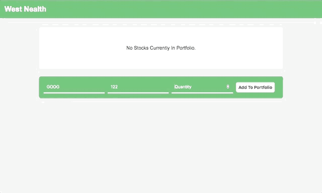
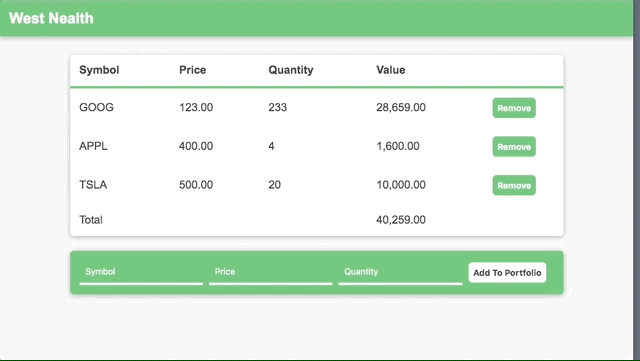

# Server and Client Typescript Example

This repository contains a simple web application (stock portfolio). This project includes both **server** and **client** modules, interfacing via a well defined API contained within the **shared** module.

The driving direction during development was *safety*. Both **server** and **client** cannot assume the structure of the messages they receive. That is why I validate all incoming JSON objects as valid **MSG** definitions before use. These definitions are shared between **server** and **client**.

This is the result of my first 6 hours with **Typescript**. This document will layout it's features and shortcomings.

## Features
- **Angular SPA Front-End** (Custom Components, Two-way Data Binding, Sending Requests to Servers, Handling Errors, etc.)
- **Node + Express Back-End** (Route Handling, Parsing Requests, Protection against Undefined Messages, Data Management, Responses, etc.)
- **Simple and Solid API** (Class based Messages and Data Structures designed using derivation, Simple Error Handling, etc.)

## Visual Demonstrations

### Fast Single Page Application (Angular):

### Well defined API back-end with informative Logging (Node + Express):

### Responsive Design (CSS):

## Missing
- Authentication/Session Management (Check out the [Session Manager](https://github.com/dgski/hashtag-dot-minimal/blob/master/sessions.rkt) I wrote for my [Reddit Clone](https://github.com/dgski/hashtag-dot-minimal) as an Example)
- Proper Database (SQL or KeyValue) for Data Management
- More Idiomatic Object-based design on backend